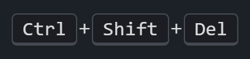
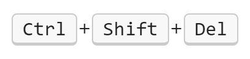
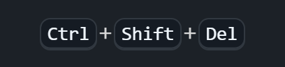
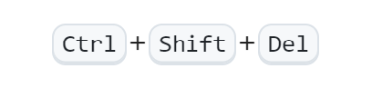
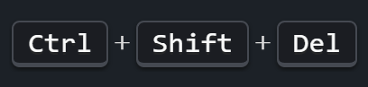
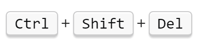

# Kbd for Obsidian

Style and quickly insert `<kbd>` tags in your notes for beautiful keyboard key formatting.

---

## Features
<table>
<tr>
<td></td>
<td>Dark Theme</td>
<td>Light Theme</td>
</tr>
<tr>
<td>Default</td>
<td></td>
<td></td>
</tr>
<tr>
<td>GitHub</td>
<td></td>
<td></td>
</tr>
<tr>
<td>Stack Overflow</td>
<td></td>
<td></td>
</tr>
</table>

- Styles all `<kbd>` tags in your notes for both light and dark themes.
- Command Palette action: **Wrap selection with `<kbd>`**.
- **Customizable hotkey**: Set your own preferred keyboard shortcut in Settings → Hotkeys.
- **Multiple cursor support**: Select multiple text portions and wrap them all at once.
- Automatically **unwraps** if the selection is already inside `<kbd>` tags, letting you toggle formatting on and off.
- **Context menu** entry: Right-click to quickly wrap or unwrap the current selection with `<kbd>` tags.
- Works seamlessly in the editor and preview modes.

---

## Demo

*Shows the command and styling in action.*

---

## How to Use

1. **Select text** in your note you want to format as a keyboard key.
   - **Tip**: Hold <kbd>Ctrl / Cmd</kbd> and click to create multiple selections for batch wrapping.
2. Use the command palette (<kbd>Ctrl / Cmd</kbd> + <kbd>P</kbd>) and search for **Wrap selection with `<kbd>`**.
3. Or, assign a custom hotkey in **Settings → Hotkeys** for quick access.
4. The selected text will be wrapped in `<kbd></kbd>` tags and styled automatically.

---

## Setting Up Hotkeys

This plugin doesn't include a default hotkey to avoid conflicts with your existing shortcuts. To set up a custom hotkey:

1. Go to **Settings → Hotkeys**
2. Search for "Wrap selection with `<kbd>`"
3. Click the **+** button to assign your preferred key combination

*Popular choices include* <kbd>Ctrl / Cmd</kbd> + <kbd>K</kbd> *or* <kbd>Ctrl / Cmd</kbd> + <kbd>Shift</kbd> + <kbd>K</kbd>*.*

---

## How to Install

### From within Obsidian

1. Open **Settings → Third-party plugins**
2. Make sure **Safe mode** is **off**
3. Click **Browse community plugins**
4. Search for "Kbd"
5. Click **Install**
6. Activate the plugin

---

## Customization

- **Hotkey**: Set up your preferred keyboard shortcut in *Settings → Hotkeys*.
- **Kbd Style**: Choose from three built-in styles in *Settings → Kbd*:
  - **Default**: Clean, modern style with subtle borders
  - **GitHub**: Mimics GitHub's keyboard key styling
  - **StackOverflow**: Recreates StackOverflow's kbd tag appearance

---

## Support & Feedback

- Found a bug or have a feature request? [Open an issue](https://github.com/keithwalsh/obsidian-kbd/issues) on GitHub.
- For questions or help, use the Obsidian forum or Discord.

---

*This plugin is provided for free. If you find it useful, consider starring the repository or sharing feedback!*
