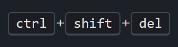
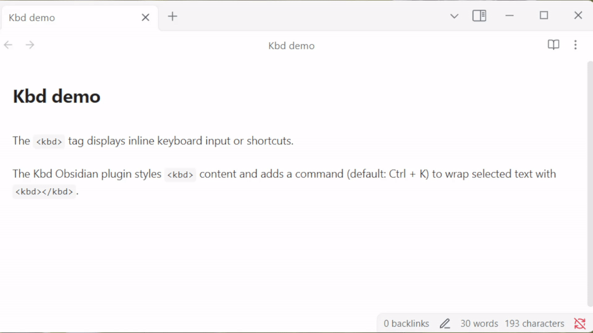

# Kbd for Obsidian

Style and quickly insert `<kbd>` tags in your notes for beautiful keyboard key formatting.

---

## Features

<table><tr><td></td><td></td></tr></table>

- Styles all `<kbd>` tags in your notes for both light and dark themes.
- Command Palette action: **Wrap selection with `<kbd>`**.
- Default hotkey: <kbd>Ctrl / Cmd</kbd> + <kbd>K</kbd> (customizable in Settings → Hotkeys).
- **Multiple cursor support**: Select multiple text portions and wrap them all at once.
- Works seamlessly in the editor and preview modes.

---

## Demo

*Shows the command and styling in action.*

---

## How to Use

1. **Select text** in your note you want to format as a keyboard key.
   - **Tip**: Hold <kbd>Ctrl / Cmd</kbd> and click to create multiple selections for batch wrapping.
2. Use the command palette (<kbd>Ctrl / Cmd</kbd> + <kbd>P</kbd>) and search for **Wrap selection with `<kbd>`**.
3. Or, use the default hotkey: <kbd>Ctrl / Cmd</kbd> + <kbd>K</kbd>.
4. The selected text will be wrapped in `<kbd></kbd>` tags and styled automatically.

---

## Hotkeys

| Hotkey                               | Action                                 |
|--------------------------------------|----------------------------------------|
| <kbd>Ctrl / Cmd</kbd> + <kbd>K</kbd> | Wrap selection with `<kbd>` tags       |

*You can change or remove this hotkey in* **Settings → Hotkeys** *like any other command.*

---

## How to Install

### From within Obsidian

1. Open **Settings → Third-party plugins**
2. Make sure **Safe mode** is **off**
3. Click **Browse community plugins**
4. Search for "Kbd"
5. Click **Install**
6. Activate the plugin

---

## Customization

- **Hotkey**: Change or remove the default hotkey in *Settings → Hotkeys*.
- **Styles**: To further customize the appearance of `<kbd>` tags, add your own CSS snippets in Obsidian's Appearance settings.

---

## Support & Feedback

- Found a bug or have a feature request? [Open an issue](https://github.com/keithwalsh/obsidian-kbd/issues) on GitHub.
- For questions or help, use the Obsidian forum or Discord.

---

*This plugin is provided for free. If you find it useful, consider starring the repository or sharing feedback!*
